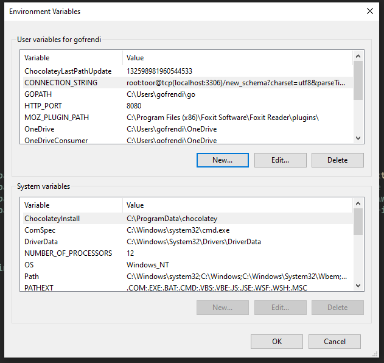

# How to run

On Linux/Mac with Bash shell:

```bash
source .env
go run main.go
```

On windows:

Set the environment variable (follow [this guide](https://www.alphr.com/environment-variables-windows-10/))

Your environment variables should now looks like this:



Run the command:

```
go run main.go
```